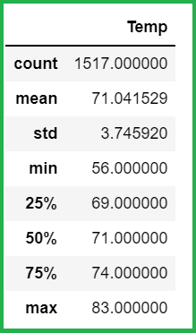

# surfs_up

## Overview of the project

In this project, we were working on a weather data-set using SQLite. SQLite is a lightweight and easy-to-setup relational database engine that can be easily integrated into various types of devices including portables and computers.

### Purpose
The main purpose of this project was to analyze the weather data-set for the month of `june` and `december` to
understand how the weather changes across the months. A clear understanding of the weather trends in the two months
can be useful in getting a handle on the weather across the year. This will be helpful in making a decision
whether it would be worthy to invest in a surf and shake shop or not.

## Results

The mean temperature for June is approx 75°F, which is higher than the mean temperature of 71°F for December.

The minimum temperature for june is 64°F, which is higher than the minimum temperature of 56°F for December.

The maximum temperature for june is 85°F, which is higher than the minimum temperature of 83°F for December.

Although the number of readings captured for the month of `December` are lower than that of `June`, but with the given
data, we can deduce that `75%` of the temperature readings in `December` are less than the mean temperature reading
in `June`.

If we utilize the IQR rule to identify outliers, it seems that there are some outliers present in the temperature
readings for the month of `June`. The temperature readings for the month of `June` greater than **83°F**
(which is 77 + (IQR=4)*1.5) seem to be outliers. This indicates that the max temperature readings for both
`June` and `December` months seem to be similar although it is less likely that temperatures in `December` reach
that high as compared to `June`.

## Summary

