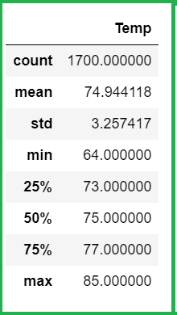

# Surfs_up

## Overview of the project

In this project, we were working on a weather data-set using SQLite. SQLite is a lightweight and easy-to-setup relational database engine that can be easily integrated into various types of devices including portables and computers.

### Purpose
The main purpose of this project was to analyze the weather data-set for the month of `june` and `december` to
understand how the weather changes across the months. A clear understanding of the weather trends in the two months
can be useful in getting a handle on the weather across the year. This will be helpful in making a decision
whether it would be worthy to invest in a surf and shake shop or not.

## Results

The mean temperature for June is approx 75°F, which is higher than the mean temperature of 71°F for December.

The minimum temperature for june is 64°F, which is higher than the minimum temperature of 56°F for December.

The maximum temperature for june is 85°F, which is higher than the minimum temperature of 83°F for December.

Although the number of readings captured for the month of `December` are lower than that of `June`, but with the given
data, we can deduce that `75%` of the temperature readings in `December` are less than the mean temperature reading
in `June`.

If we utilize the IQR rule to identify outliers, it seems that there are some outliers present in the temperature
readings for the month of `June`. The temperature readings for the month of `June` greater than **83°F**
(which is 77 + (IQR=4)*1.5) seem to be outliers. This indicates that the max temperature readings for both
`June` and `December` months seem to be similar although it is less likely that temperatures in `December` reach
that high as compared to `June`.

## Summary

We can observe that the standard deviation for the temperature reading data is not much which indicates that the
temperature does not vary much from the mean for the months of `June` and `December`. We can extrapolate the temperature
readings for the rest of the year using this data. All in all, this data provides us a hint that weather in Oahu is
tropical, does not fluctuate much and is suitable for surfing and a scoop of ice-cream. By filtering the data,
from the most active station, it can be further decided as to where the shop can be opened.

We have devised two additional queries in order to derive more insights from the available data:

1. We can derive the precipitation data for the months of `June` and `December` and get a feel of how precipitation
levels are for Oahu. Precipitation levels need to be checked and are quite important for Surfing as it is not possible
or advisable to surf in rainy conditions!
In order to derive the precipitation data for the months of June and December, we have used the following code:

2. We have also derived the **min, max, and average precipitation** values for the most active station for the month of `June`
and `December` in order to see how precipitation values change for the station in the two months. The same query can be used to
retrieve the precipitation levels for other stations as well and this can help us with the best location. Although, precipitation
levels are not likely to change much with different stations on the same island but it still helps in finding the most suitable
location.
In order to derive the min, max and average precipitation data for the months of June and December for the most active station,
we have used the following query:

